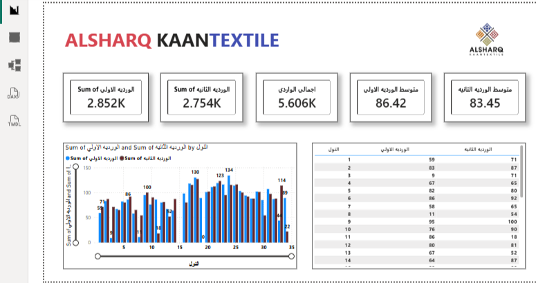

# Loom-Performance-Analytics
🧶 لوحة بيانات مراقبة إنتاج المنسوجات | Textile Production Dashboard مشروع تحليل بيانات تفاعلي تم تصميمه لمراقبة وتحليل كفاءة الإنتاج في مصنع منسوجات، مع التركيز على تتبع أداء "الأنوال" (Looms) خلال ورديات العمل المختلفة.
📝 وصف المشروع (Project Overview)
يهدف المشروع إلى توفير رؤية دقيقة لحظية لإجمالي الإنتاج والواردات، ومقارنة الأداء بين الوردية الأولى والوردية الثانية لضمان استمرارية الجودة والكفاءة الإنتاجية. تم بناء التقرير باستخدام Power BI لتحويل البيانات الخام إلى رؤى قابلة للتنفيذ.
🛠️ الميزات والتحليلات (Key Features)
مؤشرات الأداء الرئيسية (KPIs):
إجمالي الوارد: 5.606K (وحدة إنتاج).
تتبع الورديات: مراقبة إنتاج الوردية الأولى (2.852K) مقابل الوردية الثانية (2.754K).
تحليل المتوسطات: حساب متوسط الإنتاج لكل وردية (86.42 للوردية الأولى و 83.45 للثانية).
تحليل أداء الماكينات (Loom Analysis):
رسم بياني عمودي (Clustered Column Chart) يقارن إنتاج كل "نول" بشكل منفصل بين الورديتين، مما يساعد في تحديد الماكينات الأكثر إنتاجية أو التي تحتاج لصيانة.
جدول بيانات تفصيلي: يعرض أرقاماً دقيقة لكل نول لسهولة المراجعة والتدقيق.
🧰 الأدوات والتقنيات (Tools & Skills)
Data Visualization: Power BI.
Analytics: استخدام لغة DAX لعمل العمليات الحسابية المعقدة والمتوسطات الحسابية.
Data Modeling: ربط بيانات الإنتاج اليومي بأرقام الماكينات والورديات.

